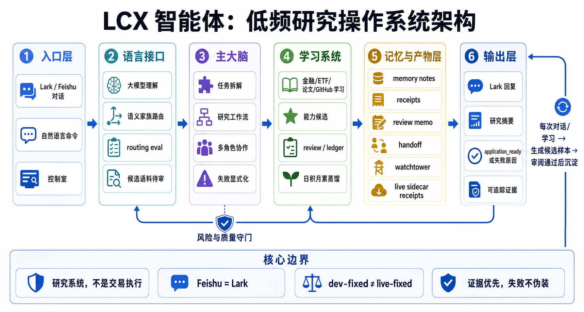
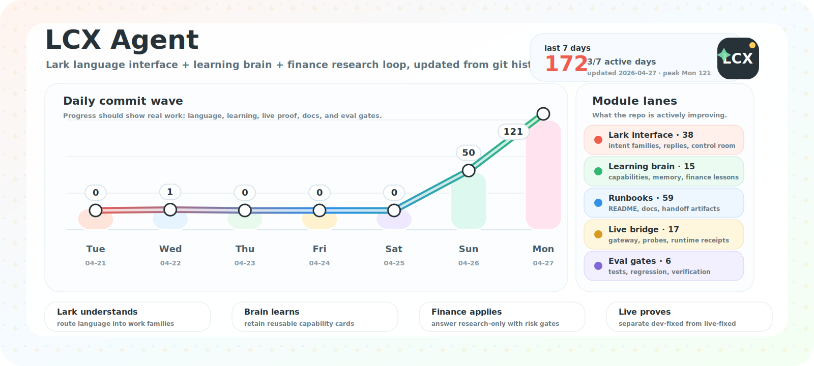

# LCX Agent



[](docs/assets/lcx-agent-daily-progress-wave.svg)

LCX Agent is a personal research operating system built on top of OpenClaw.
Its job is to turn one Lark/Feishu control room into a practical daily loop:
understand the operator's language, route the work, learn useful material,
preserve evidence, and answer with honest status.

This is not the upstream OpenClaw product README. This repository is the
`lcx1215/lcx-s-openclaw` development fork where LCX Agent behavior is designed,
tested, and hardened before any live rollout.

## At A Glance

| Layer                   | Responsibility                                                                                                |
| ----------------------- | ------------------------------------------------------------------------------------------------------------- |
| Lark language interface | Classify natural-language requests into work families instead of matching one sentence at a time.             |
| Control room            | Return one readable summary first, with specialist detail available only when needed.                         |
| Learning brain          | Convert approved material into retrievable lessons, capability cards, correction notes, and review artifacts. |
| Finance research lane   | Support low-frequency ETF, major-asset, and leading-company research with risk gates.                         |
| Truth surface           | Separate searched, learned, written, inferred, dev-fixed, and live-fixed states.                              |
| Live bridge             | Keep Lark/Feishu runtime proof separate from local development proof.                                         |

## What This Project Is

LCX Agent turns OpenClaw into a low-frequency research and operating loop:

- one main Lark/Feishu control room for natural-language requests
- internal routing across research, learning, operations, and audit lanes
- summary-first answers, with specialist detail only when needed
- explicit truth surfaces for what was searched, learned, written, routed, or
  merely inferred
- durable correction and learning artifacts instead of relying on chat memory
- hard separation between development fixes and live Feishu/Lark verification

The main use case is daily-frequency research and screening around ETFs, major
assets, and leading companies. Fundamentals are used for filtering and
conviction; technicals are used for timing; risk gates are used for survival.

## What This Project Is Not

- not an autonomous trading agent
- not a high-frequency execution system
- not a generic "learn anything about making money" bot
- not a claim that every commit in this repo is already live in Lark/Feishu
- not a replacement for upstream OpenClaw; it is a stricter operating layer on
  top of the OpenClaw runtime

Nothing in this repository should be read as financial advice.

## Core Ideas

### Control Room First

The expected user experience is one main control room. The user should be able
to ask broad questions like:

- "What matters today?"
- "What is most likely wrong?"
- "Continue the current research line."
- "Did the learning session actually finish?"
- "Is this live-fixed or only dev-fixed?"

The system should classify the request, route internally, and return a readable
answer without making the user manually remember multiple specialist chats.

### Truth Surfaces

LCX Agent prefers honest degraded output over polished fake certainty. Important
reply surfaces distinguish:

- live verification vs local development proof
- started vs completed work
- search available vs search assumed
- written artifact vs failed write
- active learning session vs stale session
- anomaly evidence vs fresh live probe
- generic plan vs bounded next action

This matters because the system is meant to be operated over weeks and months,
not just demoed once.

### Learning That Compounds

Learning is only useful when it changes future judgment. LCX Agent tries to turn
learning runs into:

- concise keeper lessons
- reusable decision rules
- correction notes
- stale/downrank decisions
- follow-up items
- operating-loop improvements

The goal is not more text. The goal is better future decisions.

### Dev-Fixed Is Not Live-Fixed

This repository is the development fork. A change is only live-fixed after it
has been migrated into the live runtime, built, restarted, probed, and verified
through the real Lark/Feishu entry path.

Local tests and synthetic probes can make a change dev-fixed. They do not make
it live-fixed by themselves.

## Module Responsibilities

These short labels are the intended meaning of the main project files and
directories. They replace generic import-history labels with the actual LCX
Agent responsibilities.

| Path                         | Owns                                                                                              |
| ---------------------------- | ------------------------------------------------------------------------------------------------- |
| `README.md`                  | Project identity, operating model, and contributor orientation.                                   |
| `AGENTS.md`                  | Local doctrine, safety rules, and day-to-day engineering contract.                                |
| `extensions/feishu/src/`     | Lark/Feishu control-room routing, language families, visible replies, and live channel behavior.  |
| `src/agents/`                | Tool catalog, model/provider routing, system prompt assembly, and agent runtime integration.      |
| `src/agents/tools/finance-*` | Finance learning, source intake, capability cards, retrieval review, and governance tools.        |
| `src/hooks/bundled/`         | Scheduled learning, correction, memory hygiene, operating-loop, and workface artifact production. |
| `src/auto-reply/`            | Command replies, status/context surfaces, and user-visible control-room protocol answers.         |
| `src/gateway/`               | Gateway protocol, server methods, channel transport, and runtime health boundaries.               |
| `src/infra/`                 | Shared receipts, anomaly records, filesystem/runtime utilities, and operational plumbing.         |
| `apps/`                      | macOS, iOS, Android, and shared app surfaces around the OpenClaw runtime.                         |
| `docs/`                      | Operator docs, runbooks, concepts, and public-facing explanations.                                |
| `docs/assets/`               | README visuals and generated project-progress artifacts.                                          |
| `scripts/`                   | Development, release, smoke-test, and maintenance automation.                                     |
| `test/fixtures/`             | Stable sample inputs for routing, learning, finance, and regression tests.                        |

Protected memory files such as `memory/current-research-line.md` should not be
casually edited. They are treated as working state, not scratch notes.

## Current Engineering Bias

The default mode is baseline hardening:

1. eliminate silent failure
2. preserve stable Feishu/Lark, queue, nightly batch, and operating-loop paths
3. make degraded states explicit
4. keep shared memory clean
5. improve routing clarity
6. avoid expanding surface area without evidence

Small, bounded patches are preferred over broad rewrites. If a feature cannot
prove what it did, it should not pretend to be complete.

## Getting Started For Development

Runtime baseline: Node 22 or newer.

```bash
pnpm install
pnpm build
pnpm test
```

Run targeted tests while working:

```bash
pnpm vitest run extensions/feishu/src/bot.test.ts
pnpm vitest run extensions/feishu/src/intent-matchers.test.ts extensions/feishu/src/surfaces.test.ts
pnpm vitest run src/infra/operational-anomalies.test.ts
```

Useful checks:

```bash
pnpm check
pnpm exec oxfmt --check <files>
pnpm exec oxlint <files>
git diff --check -- <files>
```

If `pnpm` is not available in the shell, use Corepack:

```bash
corepack enable --install-directory /tmp/corepack-bin
PATH="/tmp/corepack-bin:$PATH" pnpm test
```

## Live Lark/Feishu Verification

For live work, keep the proof chain explicit:

1. build the live runtime
2. restart the live gateway/app path
3. run channel status with probe
4. send or replay a real Lark/Feishu message
5. inspect reply-flow logs and the user-visible reply

A useful local command for channel health is:

```bash
openclaw channels status --probe
```

For Feishu/Lark reply-flow debugging, inspect:

```bash
~/.openclaw/logs/feishu-reply-flow.jsonl
~/.openclaw/logs/gateway.log
```

`feishu-reply-flow.jsonl` is the stronger delivery-level artifact when it is
fresh. If it is missing or stale, use `gateway.log` only as weaker gateway
dispatch evidence and pair it with the visible Lark/Feishu reply before calling
the path live-fixed.

Do not call a dev-only patch live-fixed until the real visible Lark/Feishu path
has been checked.

## Relationship To OpenClaw

OpenClaw provides the execution substrate: gateway, channel integrations,
agent runtime, CLI, tools, sessions, and platform apps.

LCX Agent adds the operating layer: research discipline, control-room semantics,
learning carryover, memory hygiene, correction loops, truth surfaces, and daily
workface behavior.

Upstream project:

- https://github.com/openclaw/openclaw
- https://docs.openclaw.ai

This fork keeps upstream compatibility where practical, but the README and
default operating doctrine describe the LCX Agent use case rather than the
general OpenClaw product.

Some internal files and scripts still use `lobster_*` names. Treat those as
legacy compatibility handles for the existing local runtime, not as the public
project identity. They should be migrated gradually only when the live path and
artifact history stay compatible.

## Status

This is an active personal development fork. Expect a dirty worktree, local
experiments, and a strict distinction between:

- `dev-fixed`: implemented and verified in this checkout
- `live-fixed`: migrated, built, restarted, probed, and verified through the
  real Lark/Feishu path

The system is intentionally optimized for long-horizon usefulness over
impressive demos.
