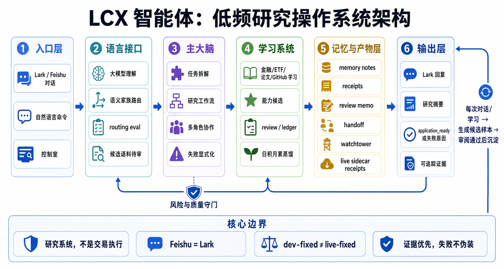
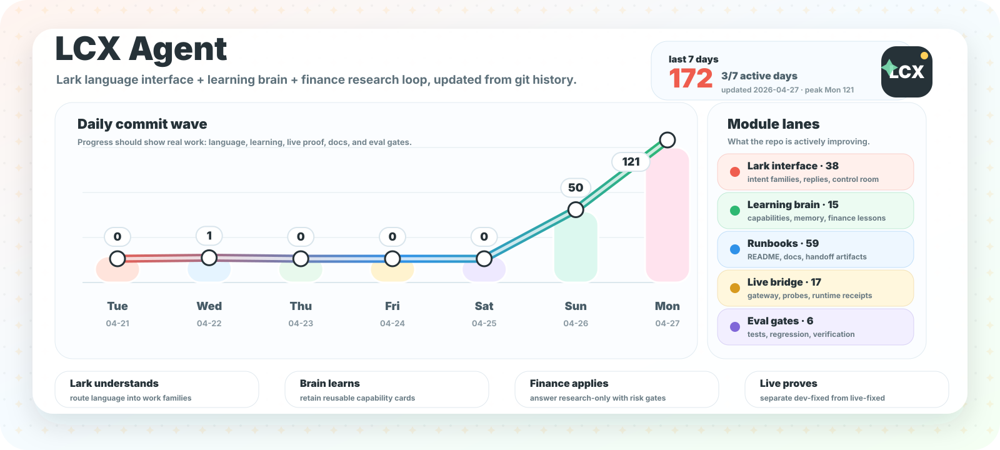

# LCX Agent



[](docs/assets/lcx-agent-daily-progress-wave.svg)

LCX Agent is a personal AI research operating system built on top of the
OpenClaw runtime. It uses Lark / Feishu as the main control room, routes natural
language requests into specialist workflows, and keeps durable evidence about
what was read, tested, learned, promoted, or blocked.

The project is not an autonomous trading bot. Its finance scope is research
only: ETF, major asset, macro, large-cap company, risk, and timing discipline.
The goal is steady daily improvement with hard boundaries, not hype, hidden
execution, or fake user-visible proof.

## What It Does

LCX Agent combines five layers:

| Layer        | Role                                                                     |
| ------------ | ------------------------------------------------------------------------ |
| Control room | Lark / Feishu natural-language entrypoint for one real user.             |
| Harness      | Permission, risk, eval, promotion, and user-visible proof gates.         |
| Hermes       | Context packets, handoffs, receipts, review artifacts, and message flow. |
| Local brain  | Qwen / MLX local adapter training, eval, and durable learning surfaces.  |
| Governance   | Doctor, radar, mind model, flow graph, head-tail, and recovery checks.   |

The system is designed to answer a practical question every day: what can the
agent safely understand, research, remember, and improve without confusing dev
proof, external-channel binding, and real user-visible proof?

The product rule is intentionally plain: 用户入口简单, internal roles can be
specialized. The control-room answer should be readable first, with specialist
detail, receipts, eval proof, and protocol labels kept behind operator surfaces
unless the user explicitly asks for them.

## Core Boundaries

- `core-ready` is not `user-visible-observed`.
- A stored source is not learned capability.
- A receipt is not model-weight absorption.
- A `parseRecovered` eval case is not a clean promotion pass.
- One runtime should use one selected clean local-brain adapter, not multiple
  LoRA adapters stacked together.
- Finance outputs are research-only and are not investment advice.
- Current market, price, fundamental, ETF, option, macro, or vendor numbers must
  pass `finance_data_gateway_snapshot` / 金融数据网关 and carry provenance before
  reaching Qwen, Lark, memory, or a visible summary.
- Polymarket and prediction-market sources are research inputs only: no wallet
  connection, no order placement, no copy trading, and no latency arbitrage.
  Use them as weak evidence only after a real market metadata packet, resolution
  ambiguity review, close time, orderbook/liquidity timestamp, thin-liquidity
  downrank decision, and source timestamp are present.

## Main Operator Commands

Start with the local runbook:

```bash
sed -n '1,220p' ops/local-brain/README.md
```

Recover current state in a compressed or new coding window:

```bash
node --import tsx scripts/operator/lcx-context-recovery-exam.ts --handoff
node --import tsx scripts/operator/lcx-governance-autopilot.ts --json
```

The governance autopilot writes the latest machine-readable and one-screen
handoff snapshots:

```text
/Users/liuchengxu/.openclaw/workspace/state/lcx-governance-autopilot-latest.json
/Users/liuchengxu/.openclaw/workspace/state/lcx-evolution-promotion-digest-latest.json
/Users/liuchengxu/.openclaw/workspace/state/lcx-context-recovery-handoff-latest.md
```

Use those files for orientation, then rerun owner commands before acting on
volatile runtime truth such as PIDs, active eval, selected adapters, and
external-channel binding status.

## Governance Stack

For non-trivial engineering, promotion, module learning, Lark external-channel,
memory, or recovery work, run the owner stack instead of relying on chat
history:

```bash
node --import tsx scripts/operator/lcx-problem-cluster-radar.ts --json
node --import tsx scripts/operator/lcx-commercial-acceptance-harness.ts --json
node --import tsx scripts/operator/lcx-change-impact-plan.ts --json
node --import tsx scripts/operator/local-brain-training-plan.ts --json
node --import tsx scripts/operator/lcx-external-channel-binding.ts --json
node --import tsx scripts/operator/lcx-live-fadeout-audit.ts --json
node --import tsx scripts/operator/lcx-mind-model.ts --json
node --import tsx scripts/operator/lcx-flow-graph.ts --json
node --import tsx scripts/operator/lcx-head-tail-consistency.ts --json
node --import tsx scripts/operator/lcx-context-recovery-exam.ts --json
```

`lcx-governance-autopilot.ts` runs that stack as a read-only coordinator. It
does not start training, rebuild train slices, mutate the external sender
compatibility path, edit provider config, touch protected memory, or claim
user-visible-observed.

## Local Brain And Promotion

Qwen local-brain work is supervised by `local-brain-training-plan` and related
operator scripts. Before starting any heavy training, eval, or guard loop,
check for active processes:

```bash
ps -axo pid,ppid,stat,etime,command | rg \
  'minimax-brain-training-guard|minimax-quota-brain-saturator|minimax-brain-teacher-batch|local-brain-distill-eval|mlx_lm (generate|lora)'
```

The promotion rule is strict: only a clean selected adapter with passing eval,
no failed cases, no parse errors, and no parseRecovered cases can become the
runtime starting point. Later useful capability must flow back through teacher
data, dataset, eval, and promotion into the next unified clean adapter.

## Lark / Feishu External Channel Proof

Lark/Feishu is the external communication channel between the owner and LCX
Agent, not a second live brain or second runtime truth source. User-visible
proof is intentionally separate from local proof. Lark official APIs, SDKs, or
open-source connector code are connector implementations only; they do not own
model authority, runtime truth, or brain state.

Forward status names are `core-ready`, `external-channel-bound`, and
`user-visible-observed`. Legacy `live-runtime-updated`, `live-user-seen`, and
`live-visible-fixed` fields may still appear during migration; treat them as
`legacy-live-runtime-updated`, `legacy-live-user-seen`, and
`legacy-live-visible-fixed` compatibility labels.

| State                    | Meaning                                                             |
| ------------------------ | ------------------------------------------------------------------- |
| `core-ready`             | Local tests, smokes, replay, or evals passed in the repo.           |
| `external-channel-bound` | Lark/Feishu transport routes to the selected clean LCX answer path. |
| `user-visible-observed`  | A real Lark inbound and outbound reply was observed by the owner.   |

The approved Lark external-channel binding owner is:

```bash
node --import tsx scripts/operator/lcx-external-channel-binding.ts --json
```

Only when it reports an idle `ready_for_apply` state should the bounded apply
path be used:

```bash
node --import tsx scripts/operator/lcx-external-channel-binding.ts --apply --json
```

That binding owner is the canonical source for `external-channel-bound`.
`local-brain-training-plan` now exposes `externalChannelBinding` as the primary
planner field; `liveLarkBrainBinding` remains only a legacy compatibility alias
while older owners migrate.
`lcx-external-channel-status.ts` is now the canonical read-only external-channel
status wrapper; its legacy promotion/drift evidence is read from the neutral
`lcx-external-channel-compat.ts` owner. The old promote-live aliases and
forwarding wrappers have been removed. The status wrapper must not override a
clean `lcx-external-channel-binding.ts` apply result. Commercial acceptance may
treat the channel as bound while still blocking release on
`post_migration_lark_canary_missing` until fresh real inbound/outbound Lark
evidence proves `user-visible-observed`.

The system-wide fadeout audit is:

```bash
node --import tsx scripts/operator/lcx-live-fadeout-audit.ts --json
```

It verifies that major LCX owners, package aliases, docs, governance, doctor,
and recovery surfaces prefer external-channel/user-visible proof while keeping
upstream OpenClaw live tests and historical receipts as allowed compatibility
uses.

## Cloud Migration Model

Cloud migration keeps the architecture simple: it moves the same LCX Agent core
to a supported-region cloud control station; it does not create a second live
brain. The migration target is:

```text
local LCX core
  -> cloud-runtime-ready
  -> external-channel-bound
  -> user-visible-observed
```

`cloud-runtime-ready` means the cloud control machine has one canonical
repository checkout, one canonical `~/.openclaw` state root, copied/synced operator skills,
receipts, logs, selected-clean adapter proof, and governance owners. It does not
mean external-channel delivery, user-visible-observed, or model-weight absorption.
Local system/factory rule: the local machine has one LCX system and one factory/runtime,
backed by one canonical repository and state root. Local isolation and parallel work
use linked Git worktrees only; no second repository or deployment checkout is
authoritative. Feature branches belong to GitHub/GitLab collaboration, review, and
release, not to the local runtime model.

The preferred repo path after migration is `/srv/lcx/lcx-s-openclaw`; the
preferred state root is `~/.openclaw`. Lark, WeChat, SMS, Slack, or any future
channel are communication adapters on top of the same answer path. China cloud
may mirror backup, static status, dashboard, or domestic helper surfaces, but it
must not become the canonical repo, the canonical state root, provider authority,
external-channel sender authority, or a second source of truth.

The live fadeout audit enforces this cloud boundary too:

```bash
node --import tsx scripts/operator/lcx-live-fadeout-audit.ts --json
```

## Finance Research Discipline

LCX Agent is optimized for low-frequency research and risk control:

- fundamentals for filtering;
- technicals for timing;
- macro and liquidity context for regime awareness;
- hard risk gates for survival;
- red-team invalidation before durable conclusions.

Alternative sources such as interviews, blogs, podcasts, social attention, and
market stories are weak evidence by default. They can create hypotheses and
research checks, but they do not become causality, alpha, position sizing, or
durable doctrine without source registry, reading scope, validation, review,
eval or training absorption evidence, and keep/downrank/discard decisions.

Prediction-market material follows the same rule with extra execution
boundaries. Polymarket-style markets can be used for source registry, resolution
criteria, close-date context, liquidity/orderbook snapshots, microstructure
warnings, thin-liquidity downranking, counterevidence, and paper-only strategy
audits. If resolution is ambiguous, block the conclusion. If the orderbook is
thin, downrank the signal. If a strategy lacks fees, slippage, sample-out proof,
or a failure log, reject it as research evidence. They cannot become a trading
engine, wallet/key path, copy-trading feed, position-sizing authority, forecast
authority, or same-day prediction shortcut.

## Development

Requirements:

- Node.js 22+
- pnpm 10+

Install and run checks:

```bash
pnpm install
pnpm tsgo
pnpm test
```

Common focused checks:

```bash
corepack pnpm exec oxfmt --check README.md AGENTS.md ops/local-brain/README.md
corepack pnpm exec vitest run test/lcx-governance-autopilot.test.ts
corepack pnpm exec vitest run test/lcx-external-channel-binding.test.ts
corepack pnpm exec vitest run test/local-brain-training-plan.test.ts
```

Lark / Feishu focused regressions:

```bash
corepack pnpm exec vitest run extensions/feishu/src/lark-language-handoff-receipts.test.ts
corepack pnpm exec vitest run extensions/feishu/src/lark-context-packet.test.ts
corepack pnpm exec vitest run extensions/feishu/src/learning-council.test.ts
```

## Repository Map

| Path                     | Purpose                                                                                        |
| ------------------------ | ---------------------------------------------------------------------------------------------- |
| `extensions/feishu/src/` | Lark / Feishu control-room, routing, reply, language, and external-channel compatibility code. |
| `scripts/operator/`      | Local-brain training, eval, governance, doctor, radar, and promotion tools.                    |
| `src/agents/`            | Agent runtime, system prompt, tools, routing, and review surfaces.                             |
| `src/auto-reply/`        | User-visible command replies, truth surfaces, and reply-flow evidence.                         |
| `ops/local-brain/`       | Operator runbook for local-brain training, eval, guard, and recovery.                          |
| `docs/`                  | Broader OpenClaw and LCX Agent documentation.                                                  |

## Project Lineage

This repository keeps OpenClaw as the runtime and gateway foundation while LCX
Agent adds a personal research operating layer: Lark control room, durable
learning, finance research discipline, local-brain promotion, and governance
proof surfaces.

Historical `lobster_*` names, scripts, hook labels, and runtime handles may
remain as compatibility artifacts until each path is migrated with external-channel
proof and fresh user-visible evidence.

## License

MIT.
